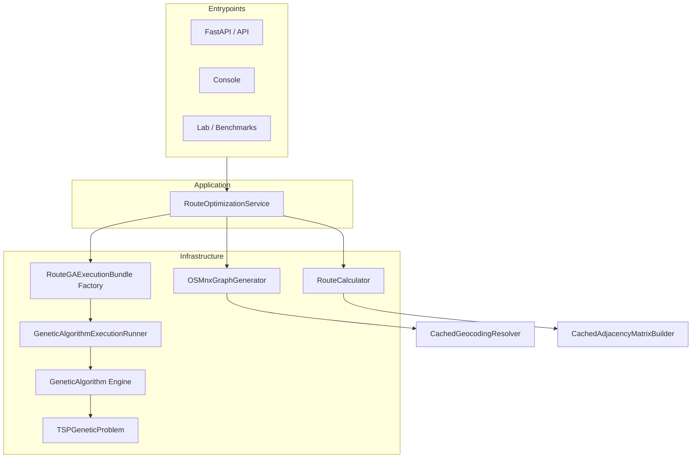
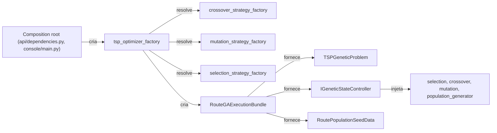
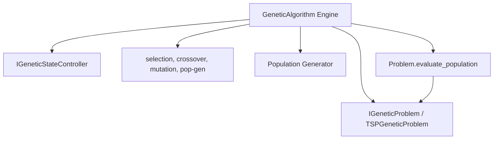
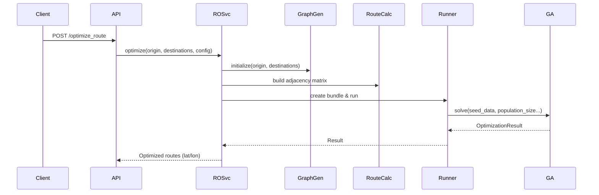

# Best Route — Repositório Umbrella

Este repositório serve apenas para referência cruzada e documentação dos projetos principais do sistema Best Route:

---

<figure style="display:block; width:80%; max-width:100%; margin:0 auto;">
	
	<figcaption style="text-align:center;">Frontend - Planner UI (preview)</figcaption>
</figure>
<br/>
<figure style="display:block; width:80%; max-width:100%; margin:0.75rem auto;">
	
	<figcaption style="text-align:center;">Console - plot view</figcaption>
</figure>
<br/>
<figure style="display:block; width:80%; max-width:100%; margin:0.75rem auto;">
	
	<figcaption style="text-align:center;">API - Swagger UI (http://localhost:{port}/docs)</figcaption>
</figure>
<br/>
## 🗺️ Diagrama de Arquitetura

Esta seção contém diagramas Mermaid que mostram a arquitetura geral do sistema, o modelo de composição (factories e strategies) e o fluxo do motor genético.

### 1) Arquitetura geral (visão macro)




### 2) Modelo de composição (factories e strategies)



### 3) Decomposição do motor GA (componentes)



### 4) Fluxo de cálculo de rota (sequence simplified)



---
 
## Repositórios do projeto

- **Backend**: [luizaaca/api_best_route](https://github.com/luizaaca/api_best_route)
- **Frontend**: [luizaaca/best_route_tsp_front](https://github.com/luizaaca/best_route_tsp_front)

---

## 📚 Documentação dos Projetos

### Backend — api_best_route

- [`README.md`](https://github.com/luizaaca/api_best_route/blob/main/README.md): Instruções de instalação, execução e visão geral da API.
- [`architecture.md`](https://github.com/luizaaca/api_best_route/blob/main/architecture.md): Arquitetura, camadas e padrões de projeto.
- [`generic_ga.md`](https://github.com/luizaaca/api_best_route/blob/main/generic_ga.md): Descrição do motor genérico de algoritmo genético.
- [`routes_optimization.md`](https://github.com/luizaaca/api_best_route/blob/main/routes_optimization.md): Modelos e pipeline de otimização de rotas.
- [`lab/README.md`](https://github.com/luizaaca/api_best_route/blob/main/lab/README.md): Execuções benchmarks e modo laboratório.
- [`changelog/`](https://github.com/luizaaca/api_best_route/tree/main/changelog): Notas de versão.

### Frontend — best_route_tsp_front

- [`README.md`](https://github.com/luizaaca/best_route_tsp_front/blob/main/README.md): Instruções, overview e exemplos de uso do frontend.
- Outros arquivos e guias: Consulte o repositório para mais detalhes técnicos e exemplos.

---

## 🚀 Como rodar localmente

Clone ambos os projetos:

```bash
git clone https://github.com/luizaaca/api_best_route
git clone https://github.com/luizaaca/best_route_tsp_front
```

Siga as instruções de cada `README.md` para instalar dependências e rodar backend e frontend.

---
